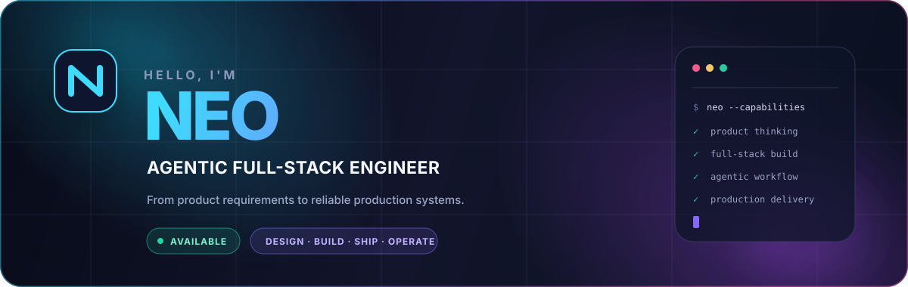

<div align="center">



<br />

[](https://github.com/neobinary997)
[](https://github.com/neobinary997/neobinary997/issues/new)
[](#delivery-pipeline)

### I turn product ideas into reliable software — from requirements to production.

**Agent 全栈开发工程师｜独立完成需求分析、架构设计、全栈开发、部署上线与持续运维**

[About](#about-me) · [Capabilities](#what-i-build) · [Stack](#technology-stack) · [Work](#selected-work) · [Contact](#lets-build-something)

</div>

<br />

## About me

I am an **Agentic Full-Stack Engineer** who takes full ownership of product delivery. I work across product thinking, frontend, backend, automation, infrastructure, and release quality — using AI agents to accelerate execution while keeping engineering judgment in the loop.

```text
Business goal  →  Product scope  →  Architecture  →  Build  →  Ship  →  Operate
```

My focus is not simply writing code. It is delivering a maintainable product that solves the right problem and runs reliably in production.

## What I build

<table>
<tr>
<td width="33%" valign="top">

### ⚡ AI & Automation

Agent-powered products, intelligent workflows, LLM integrations, internal tools, and process automation designed around real business outcomes.

</td>
<td width="33%" valign="top">

### ◈ Full-Stack Products

Modern web applications, dashboards, APIs, service integrations, data flows, and complete customer-facing product experiences.

</td>
<td width="33%" valign="top">

### 🚀 Production Delivery

Environment setup, CI/CD, containerization, deployment, observability, troubleshooting, and sustainable production operations.

</td>
</tr>
</table>

## Delivery pipeline

<table>
<tr align="center">
<td><b>01</b><br/>Discover<br/><sub>Goals & constraints</sub></td>
<td>→</td>
<td><b>02</b><br/>Design<br/><sub>Scope & architecture</sub></td>
<td>→</td>
<td><b>03</b><br/>Build<br/><sub>Frontend & backend</sub></td>
<td>→</td>
<td><b>04</b><br/>Validate<br/><sub>Quality & security</sub></td>
<td>→</td>
<td><b>05</b><br/>Ship<br/><sub>CI/CD & deployment</sub></td>
<td>→</td>
<td><b>06</b><br/>Operate<br/><sub>Observe & improve</sub></td>
</tr>
</table>

## Technology stack

<div align="center">

### Languages


### Frontend & Backend


### Delivery & Operations


</div>

## Selected work

<table>
<tr>
<td width="72%" valign="top">

### Quill

**Ultra-minimalist macOS recording + transcription.** A focused desktop product exploring a low-friction workflow from audio capture to usable text.

`macOS` `Recording` `Transcription` `Product Engineering`

</td>
<td width="28%" align="center" valign="middle">

**PRIVATE PROJECT**

Case study available during interviews or collaboration discussions.

</td>
</tr>
</table>

## How I work

- **Own the outcome** — translate business intent into scoped, shippable milestones.
- **Design for change** — choose pragmatic architecture that can evolve with the product.
- **Build production-first** — consider maintainability, security, performance, and observability early.
- **Communicate clearly** — make progress, trade-offs, risks, and next steps visible.
- **Use AI responsibly** — accelerate delivery with agents without outsourcing engineering judgment.

## Let's build something

<div align="center">

### Have a role, product idea, or technical challenge?

I am open to **full-stack / platform engineering roles**, **AI agent products**, **technical consulting**, and **end-to-end commercial delivery**.

[](https://github.com/neobinary997/neobinary997/issues/new)
[](https://github.com/neobinary997?tab=repositories)

<br />

<sub>Design thoughtfully · Build pragmatically · Ship reliably</sub>

</div>
